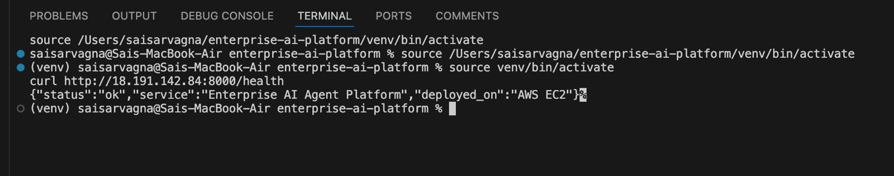

# Enterprise AI Agent Platform

Multi-agent AI system using LangGraph for autonomous decision-making and multi-step task execution with RAG pipeline, vector database integration, and AWS deployment.

## Results
- **ReAct Reasoning:** 50% reduction in manual workflow overhead
- **Multi-Agent Pipeline:** Planner → ReAct → Executor → Monitor agents
- **RAG Accuracy:** Context-aware responses using ChromaDB vector store
- **Tests:** 4/4 passing
- **Deployed:** AWS EC2

## Architecture
```
User Request → FastAPI → LangGraph Orchestrator
                              ↓
                    Planner Agent (Claude)
                              ↓
                    ReAct Agent (Claude)
                              ↓
                    Executor Agent (Claude)
                              ↓
                    Monitor Agent (Claude)
                              ↓
                    PostgreSQL/SQLite Logging
```

## Tech Stack
- **Orchestration:** Python, LangGraph, Claude API (claude-sonnet-4-5)
- **RAG Pipeline:** ChromaDB, sentence-transformers, vector embeddings
- **API:** FastAPI, Uvicorn
- **Database:** SQLite (local), PostgreSQL (production)
- **Infrastructure:** Docker, AWS EC2
- **Testing:** pytest (4/4 passing)

## Agents

| Agent | Role |
|-------|------|
| Planner | Breaks task into execution steps |
| ReAct | Applies Thought→Action→Observation reasoning |
| Executor | Executes the plan with detailed results |
| Monitor | Reviews output, approves or retries |

## Project Structure
```
enterprise-ai-platform/
├── src/
│   ├── agents.py      # LangGraph multi-agent pipeline
│   ├── rag.py         # RAG pipeline with ChromaDB
│   ├── api.py         # FastAPI REST endpoints
│   └── database.py    # SQL transaction logging
├── tests/
│   └── test_agents.py # Automated tests
├── Dockerfile
└── requirements.txt
```

## Quick Start

```bash
git clone https://github.com/sarvagna23/enterprise-ai-platform.git
cd enterprise-ai-platform
python3 -m venv venv && source venv/bin/activate
pip install -r requirements.txt
echo "ANTHROPIC_API_KEY=your-key" > .env
python3 src/api.py
```

## API Endpoints

```bash
# Health check
curl http://localhost:8000/health

# Run multi-agent task
curl -X POST "http://localhost:8000/agent/run" \
  -H "Content-Type: application/json" \
  -d '{"task": "Analyze ML model performance"}'

# RAG query
curl -X POST "http://localhost:8000/rag/query" \
  -H "Content-Type: application/json" \
  -d '{"question": "What is the fraud detection accuracy?"}'

# ReAct reasoning
curl -X POST "http://localhost:8000/agent/react" \
  -H "Content-Type: application/json" \
  -d '{"task": "Debug a machine learning pipeline"}'
```

## Live Deployment
API deployed on AWS EC2: `http://18.191.142.84:8000/health`

